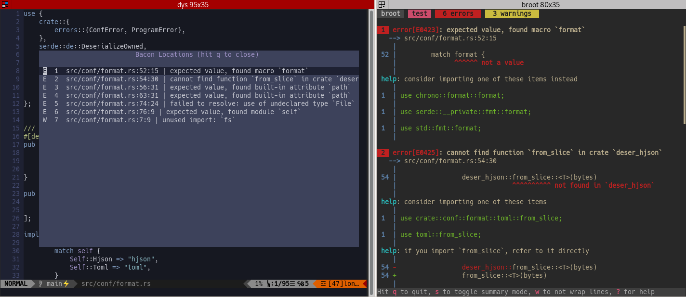

# nvim-bacon

This plugin enables viewing the locations found in a `.bacon-locations` file, and jumping to them.

# Installation

This extension may be imported with a standard plugin system, for example with [vim-plug](https://github.com/junegunn/vim-plug):

```vim
Plug 'Canop/nvim-bacon'
```

You must [enable locations export in bacon](https://dystroy.org/bacon/config/#export-locations). Add this to your bacon.prefs file:

```toml
[export]
enabled = true
```

## Usage

You'll use this plugin in nvim while a bacon instance is running in another panel, probably side to it.

To navigate among errors and warnings, you'll use either the standard Quickfix feature of your editor or nvim-bacon dedicated commands and view.

### Specialized Commands and View

The following functions are exposed by the plugin:

| Function         | Usage                                                      |
| ---------------- | ---------------------------------------------------------- |
| `:BaconLoad`     | Silently load the locations of the `.bacon-locations` file |
| `:BaconShow`     | Display the locations in a floating windoaw                |
| `:BaconList`     | Does `:BaconLoad` then `:BaconShow`                        |
| `:BaconPrevious` | Jump to the previous location in the current list          |
| `:BaconNext`     | Jump to the next location in the current list              |

You should define at least two shortcuts, for example like this:

```vimscript
nnoremap ! :BaconLoad<CR>:w<CR>:BaconNext<CR>
nnoremap , :BaconList<CR>
```

The first shortcut navigates from location to location, without opening the window.
This is probably the one you'll use all the time.
You may notice it loads the list (`:BaconLoad`) then saves the current document (`:w`), to prevent both race conditions and having a bunch of unsaved buffers.

The second shortcut, which is mapped to the <kbd>,</kbd> key, opens the list of all bacon locations:



When the list is open, you can select a line and hit <kbd>enter</kbd> or just hit the number of the location if it's in 1-9.
As there's no need to wait for the window to appear, you may just type <kbd>,</kbd><kbd>3</kbd> to go to location 3 without opening the window.

You may define other shortcuts using the various API functions.

### Quickfix Integration

Errors and warnings also populate the [Quicklist](http://neovim.io/doc/user/quickfix.html) list by default.

You can disable this feature with this configuration:

```lua
require("bacon").setup({
    quickfix  = {
         enabled = false, -- true to populate the quickfix list with bacon errors and warnings
         event_trigger = true, -- triggers the QuickFixCmdPost event after populating the quickfix list
    }
)}
```
