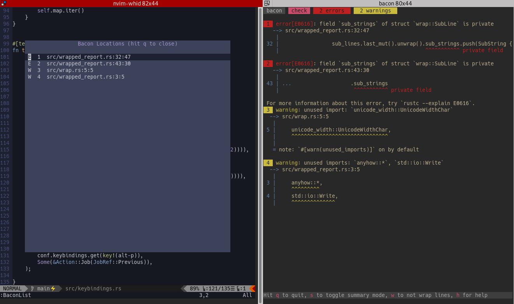

# nvim-bacon

This plugin enables viewing the locations found in a `.bacon-locations` file, and jumping to them.

This makes sense when this file is created by [bacon](https://dystroy.org/bacon) with `-e` option running in nvim's work directory or in a parent directoryi (minimal bacon version: 2.1).

## API:

The following functions are exposed by the plugin:

|Function|Usage|
|-|-|
|`:BaconLoad`| Silently load the locations of the `.bacon-locations` file|
|`:BaconShow`| Display the locations in a floating windoaw|
|`:BaconList`| Does `:BaconLoad` then `:BaconShow`|
|`:BaconPrevious`| Jump to the previous location in the current list |
|`:BaconNext`| Jump to the next location in the current list |

## Usage

You'll use this plugin in nvim while a bacon instance is running in another panel, probably side to it.


You probably want to define at least two shortcuts, for example like this:

```vimscript
nnoremap ! :BaconLoad<CR>:w<CR>:BaconNext<CR>
nnoremap , :BaconList<CR>
```

The first shortcut navigates from location to location, without opening the window.
This is probably the one you'll use all the time.
You may notice it loads the list (`:BaconLoad`) then saves the current document (`:w`), to prevent both race conditions and having a bunch of unsaved buffers.

The second shorctut, which is mapped to the <kbd>,</kbd> key, opens the list of all bacon locations:



When the list is open, you can select a line and hit <kbd>enter</kbd> or just hit the numero of the location if it's in 1-9.
As there's no need to wait for the window to appear, you may just type <kbd>,</kbd><kbd>3</kbd> to go to location 3 without opening the window.

You may define other shortcuts using the various API functions.
